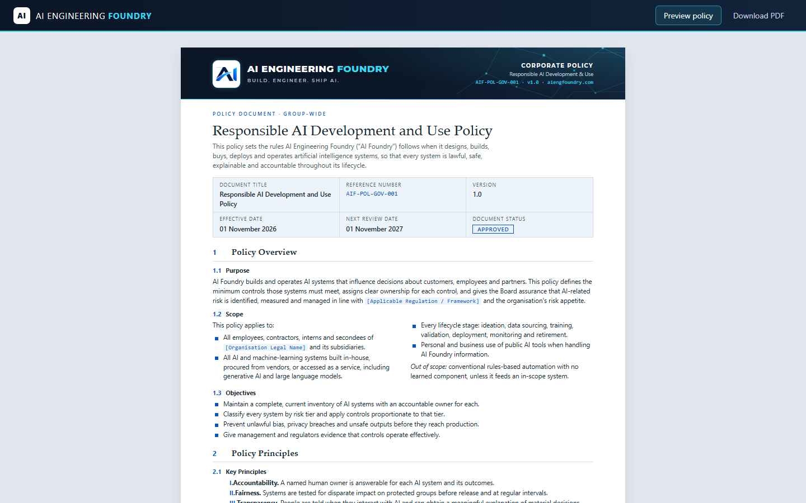

# HtmlToPDF – SelectPdf · ASP.NET Core · React

Generates the **AI Foundry Responsible AI Development and Use Policy (AIF-POL-GOV-001)** as an A4 PDF.
The policy HTML is built in C# with a `StringBuilder` and rendered to PDF server-side with
[SelectPdf](https://selectpdf.com/) using its Blink (Chromium) engine. A React front end previews the HTML and downloads the PDF.



## Project layout

```
.
├── AI-Foundry-Policy-AIF-POL-GOV-001.html   # Reference copy of the policy HTML
├── htmltopdf-api/                           # ASP.NET Core (.NET 8) minimal API
│   ├── Program.cs                           # Endpoints + SelectPdf rendering options
│   ├── PolicyHtmlBuilder.cs                 # Builds the 3-page policy HTML with a StringBuilder
│   └── Assets/logo.png                      # Letterhead logo, inlined as a data URI
└── htmltopdf-web/                           # React 19 + TypeScript + Vite front end
    ├── src/App.tsx                          # Preview / Download PDF UI
    └── vite.config.ts                       # Proxies /api/* to the API
```

## Prerequisites

- [.NET 8 SDK](https://dotnet.microsoft.com/download/dotnet/8.0)
- [Node.js](https://nodejs.org/) 20+ and npm
- Windows (SelectPdf's Blink engine ships a Windows Chromium build)

## Running locally

### 1. Start the API

```bash
cd htmltopdf-api
dotnet run --launch-profile http
```

The API listens on `http://localhost:5291`. The first build restores the SelectPdf packages, including the Chromium runtime.

| Endpoint                  | Description                                      |
| ------------------------- | ------------------------------------------------ |
| `GET /`                   | Redirects to `/policy-builder.pdf`               |
| `GET /policy-builder.html`| Policy HTML generated by `PolicyHtmlBuilder`     |
| `GET /policy-builder.pdf` | The same HTML rendered to an A4 PDF via SelectPdf |

### 2. Start the web app

```bash
cd htmltopdf-web
npm install
npm run dev
```

Open the URL Vite prints (usually `http://localhost:5173`). Requests to `/api/*` are proxied to the API.
To point at a different API address, set `HTMLTOPDF_API_URL` before running `npm run dev`.

- **Preview policy**: renders the server-generated HTML in an iframe.
- **Download PDF**: fetches `/api/policy-builder.pdf` and saves `AI-Foundry-Policy-AIF-POL-GOV-001.pdf`.

## PDF rendering settings

Configured in `htmltopdf-api/Program.cs`:

- Rendering engine: **Blink** (supports CSS variables, flexbox, grid)
- CSS media type: **print**; the HTML lays itself out as fixed A4 sheets under `@media print`
- Page size: **A4 portrait**, web page width **794 px** (210 mm at 96 dpi), zero PDF margins

## Other scripts (web)

```bash
npm run build     # Type-check and build for production
npm run lint      # Lint with oxlint
npm run preview   # Serve the production build
```

## Licensing note

This project uses the free **SelectPdf Community Edition**, which can generate PDFs of up to **5 pages**.
The 3-page policy fits within that limit. Longer documents need a commercial license; see the [SelectPdf licensing page](https://selectpdf.com/pricing/) for details.
